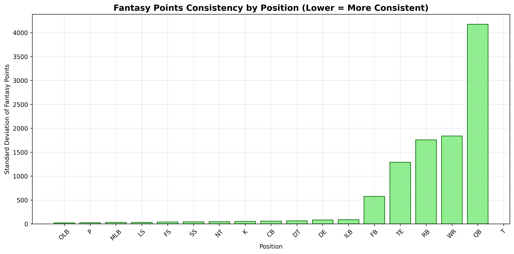
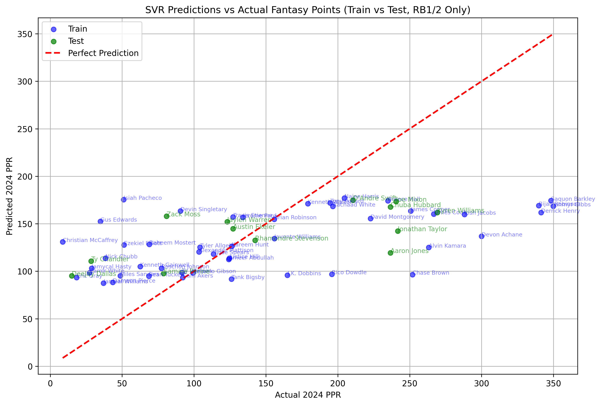
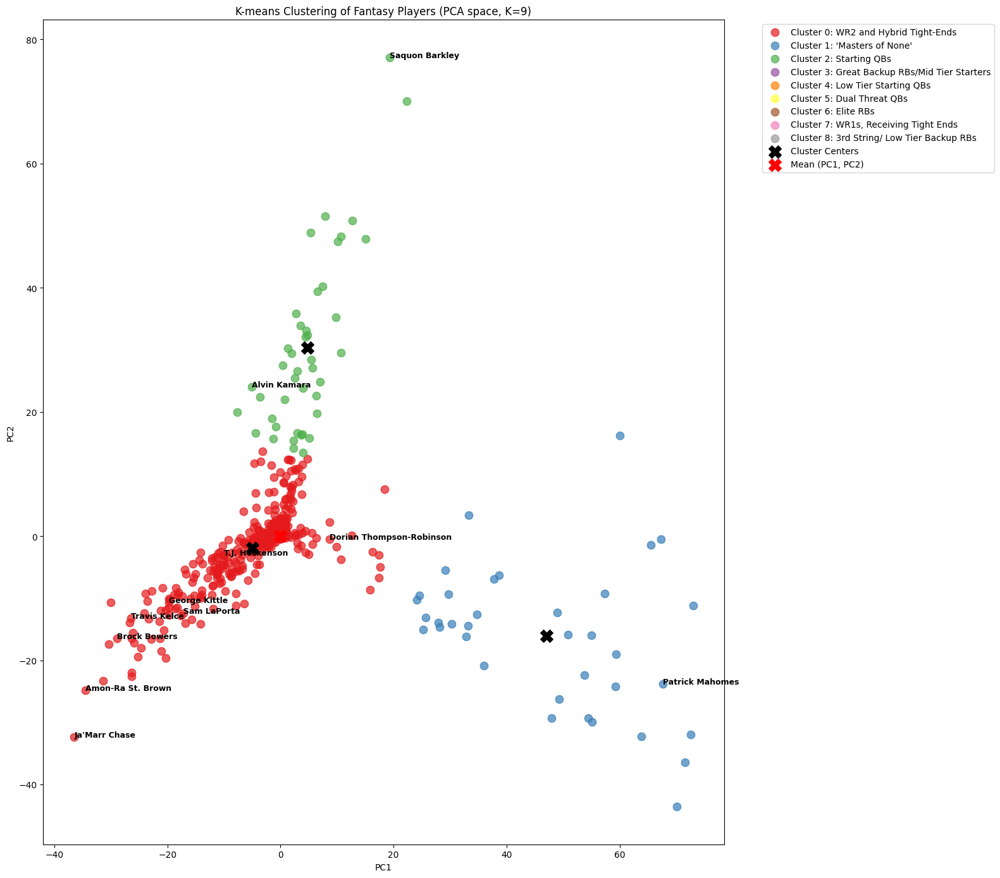

# CSE151A-Project: NFL Fantasy Football Point Projections

**Note:** If you want to take a look at our code and analysis, check out our notebooks in this repository. You may have to refresh a couple times for them to load properly.

# Table of Contents

- [1. Introduction 🏈](#1-introduction)
- [2. Figures](#2-figures)
- [3. Methods](#3-methods)
    - [3.1 Data Exploration](#31-data-exploration)
    - [3.2 Data Preprocessing](#32-data-preprocessing)
    - [3.3a Model 1 Development](#33a-model-1-development)
    - [3.4a Model 1 Enhancement](#34a-model-1-enhancement)
    - [3.3b Model 2 Development](#33b-model-2-development)
    - [3.4b Model 2 Enhancement](#34b-model-2-enhancement)
- [4. Data Exploration and Analysis](#4-data-exploration-and-analysis)
    - [4.1 Dataset Overview](#41-dataset-overview)
    - [4.2 Target Variable Creation](#42-target-variable-creation)
    - [4.3 Data Quality Assessment](#43-data-quality-assessment)
- [5. Data Visualization and Key Insights](#5-data-visualization-and-key-insights)
    - [5.1 Position Distribution Analysis](#51-position-distribution-analysis)
    - [5.2 Fantasy Points Consistency Analysis](#52-fantasy-points-consistency-analysis)
    - [5.3 Running Back Feature Correlation Analysis](#53-running-back-feature-correlation-analysis)
- [6. Advanced Analytics: Unsupervised Learning](#6-advanced-analytics-unsupervised-learning)
  - [6.1 Principal Component Analysis (PCA)](#61-principal-component-analysis-pca)
  - [6.2 K-Means Clustering Validation](#62-k-means-clustering-validation)
  - [6.3 Player Archetype Identification](#63-player-archetype-identification)
- [7a. Model 1 Development and Enhancement 🔧](#7a-model-1-development-and-enhancement)
  - [7.1a Data Preprocessing Strategy](#71a-data-preprocessing-strategy)
  - [7.2a Model 1 Performance Evolution](#72a-model-1-performance-evolution)
  - [7.3a Model 1 Insights and Limitations](#73a-Model-Insights-and-Limitations)
- [7b. Model 2 Development and Enhancement 🔧](#7b-model-2-development-and-enhancement)
  - [7.1a Data Preprocessing Strategy](#71b-data-preprocessing-strategy)
  - [7.2a Model 2 Performance Evolution](#72b-model-2-performance-evolution)
  - [7.3a Model 2 Insights and Limitations](#73b-Model-Insights-and-Limitations)

## 1. Introduction

The goal of our project was to develop a machine learning system capable of predicting NFL fantasy football performance based on historical player statistics. This problem was chosen due to its practical applications in fantasy sports, professional team scouting, and the broader challenge of predicting human athletic performance in dynamic environments.

As avid NFL fans who have spent countless hours analyzing player performance and debating draft strategies, we wanted to test whether machine learning could systematize the intuitive player evaluation that dedicated football fans develop. Fantasy football transforms every Sunday into a personal investment in player performance, where statistical analysis meets genuine passion for the game.

A robust, high-performing predictive model in this domain could revolutionize several areas:

**Fantasy Sports Applications:**
- **Automated Draft Strategy:** Our models can identify undervalued players and optimal draft positions, giving fantasy managers a competitive edge
- **Weekly Lineup Optimization:** Predictive models help determine which players to start based on matchup analysis and consistency metrics
- **Trade Evaluation:** Quantitative player valuations enable more informed trade decisions throughout the fantasy season

**Professional Team Applications:**
- **Player Scouting:** Teams can identify undervalued free agents and draft prospects who may outperform their projected draft position
- **Contract Negotiations:** Data-driven performance projections help teams make optimal contract decisions based on predicted future value rather than past achievements
- **Roster Management:** Predictive models assist in determining when to extend, trade, or release players based on projected career trajectories

**Broader Sports Analytics:**
- **Injury Impact Assessment:** Understanding how injuries affect long-term performance patterns
- **Age Curve Analysis:** Quantifying how players of different positions age and when performance typically declines
- **Scheme Fit Evaluation:** Identifying which players are likely to succeed in specific offensive systems

This project was also a natural extension of our shared passion for football and data science, allowing us to combine technical skills with genuine sports knowledge.

## 2. Figures

Our analysis includes several key visualizations that demonstrate our methodology and findings:

### Dataset Overview and Exploration

**Figure 1: Position Distribution** - Shows the composition of NFL player data across positions, revealing the scarcity principle in fantasy football where positions with fewer elite players carry premium value.


**Figure 2: Fantasy Points Consistency Analysis** - Displays scoring variability by position, with lower bars indicating more consistent, predictable scoring and higher bars showing "boom-or-bust" potential.

### Running Back Predictive Model Development

**Figure 3: Initial Correlation Analysis** - Basic relationship between 2023 rushing yards and 2024 fantasy points, establishing the foundation for our predictive approach.


**Figure 4: Multi-Feature Analysis** - Comprehensive examination of how various 2023 performance metrics (snap count, rushing yards, touchdowns, yards per carry) correlate with 2024 fantasy outcomes.


**Figure 5: Model Validation Results** - Support Vector Regression performance showing actual vs. predicted fantasy points with separate visualization of training and test data.


**Figure 6: Position-Filtered Enhancement** - Improved model performance when restricting analysis to RB1/RB2 level players, demonstrating better accuracy for fantasy-relevant decisions.

*Note: Additional figures throughout our analysis show training vs. testing errors, evaluation metrics, hyperparameter tuning results, and detailed model interpretations.*

## 3. Methods

### 3.1 Data Exploration
- **Dataset:** NFL Player Statistics (1999-2022) from Kaggle - [philiphyde1/nfl-stats-1999-2022]
- **Total Observations:** 215,243 across weekly and yearly statistics
- **Focus Period:** 2023-2024 seasons for prediction modeling
- **Key Analysis:** Position distribution, fantasy points consistency, and data quality assessment

### 3.2 Data Preprocessing
- **Target Variable Creation:** Calculated fantasy_points_ppr using standard PPR scoring rules
- **Data Filtering:** Regular season games only, position-specific analysis
- **Quality Assurance:** Handled missing values, removed duplicates, created depth chart rankings
- **Feature Engineering:** Developed reliability index combining performance and consistency metrics

### 3.3a Model 1 Development
**Support Vector Regression (SVR) Implementation:**
- **Justification:** Chosen for effectiveness with non-linear relationships and robustness to outliers
- **Features:** 2023 performance metrics (snap count, rushing yards, touchdowns, yards per carry)
- **Hyperparameter Tuning:** Grid search with 5-fold cross-validation
- **Enhancement:** Position-filtered analysis for RB1/RB2 players


```python
# Core model implementation
from sklearn.svm import SVR
from sklearn.model_selection import GridSearchCV

params = {
    'C': [1, 10, 50, 100],
    'epsilon': [0.1, 0.5, 1.0],
    'gamma': ['scale', 0.01, 0.1, 1],
    'kernel': ['rbf', 'poly']
}

grid = GridSearchCV(SVR(), params, cv=5, scoring='r2')
grid.fit(X_train_scaled, y_train)
```
### 3.4a Model 1 Enhancement
- **Position-Specific Filtering:** Focus on fantasy-relevant players (RB1/RB2 only)
- **Feature Scaling:** StandardScaler normalization
- **Validation Strategy:** 80/20 train-test split with cross-validation

### 3.3b Model 2 Development
**Principal Component Analysis (PCA) + K-means Clustering Implementation:**
- **Justification:** Chosen for its ability to analyze multiple different statistical categories and plot players against each other in different positions to analyze their value against other positions
- **Features:** 2024 performance metrics (rushing yards, rushing touchdowns, receiving yards, receiving touchdowns, receptions, passing yards, passing touchdowns, interceptions)
- **Principal Component Analysis** Found two most variant components tracked passing play and rushing play. When plotted against each other it formed a triangular branchning scatter plot.
- **K-means Clustering** Used K-means clustering on Principal Component formed features to find patterns in our data.
  
### 3.4b Model 2 Enhancement
- **Position-Specific Labeling:** Using Different K-values for our K-means Clustering yielded more clusters with different kinds of players in each cluster.
- **Comparison across Positions** The Principal Component Analysis gave us a representation of our data allowing us to compare players across all positions from RB, QB, TE, WR, despite the vastly different roles each of these play on the field
- **Evaluation of Z-score to Fantasy Percentile** Taking the Z-score of every player in the PCA graph, and comparing it against their season fantasy scores gives us the following graph:


## 4. Data Exploration and Analysis

### 4.1 Dataset Overview


Our dataset is a comprehensive collection of NFL statistics from 1999-2022, comprising **215,243 total observations** distributed across eight CSV files. The data have two primary axes: (weekly vs. yearly) and (player vs. team), which is ideal for our goal of building a fantasy football prediction system.


**Player-Level Data (Primary Focus):**
- **Weekly Offensive Stats (58,629 observations):** This is the most critical dataset for our project. Each observation represents a single player's offensive performance in one game.
- **Yearly Offensive Stats (7,133 observations):** Aggregated weekly data (16-17 games) into full-season summaries for each player, useful for establishing baseline performance.
- **Defensive Stats (Weekly & Yearly):** While our primary focus is offense, the 117,993 weekly and 16,148 yearly defensive observations provide context for team defensive efficiency.

**Team-Level Data (Contextual):** The team-level files provide broader context on team tendencies (e.g., pass-heavy vs. run-heavy offenses) that can influence a player's opportunity and projected output.

### 4.2 Target Variable Creation


For our fantasy football prediction system, we engineered our target variable `fantasy_points_ppr` based on standard PPR (Points Per Reception) league scoring:

- **1 point per reception** ('receptions')
- **0.1 points per rushing/receiving yard** ('rushing_yards', 'receiving_yards')
- **6 points per rushing/receiving touchdown** ('rushing_tds', 'receiving_tds')
- **4 points per passing touchdown** ('passing_tds')
- **-2 points per interception thrown** ('interceptions')

This engineered column serves as a continuous variable on a ratio scale and represents the value our models aim to predict for future player performance.

### 4.3 Data Quality Assessment


**Missing and Duplicate Values Analysis:**
- **No duplicate rows found** across the primary datasets
- **Missing values identified** in the "yards per carry" column, which we handled by initializing with 0s (indicating no rushing attempts)
- **Data integrity maintained** through systematic filtering and validation processes

## 5. Data Visualization and Key Insights

Our comprehensive visualization approach revealed critical patterns that directly informed our modeling strategy:

### 5.1 Position Distribution Analysis


**Description:** This pie chart illustrates the distribution of players across different positions within our dataset. From a fantasy drafting perspective, this visualization is key to understanding positional value.

**Key Insights:**
- **Wide Receivers comprise the largest segment** of skill position players
- **Running Backs and Tight Ends represent smaller but crucial position groups**
- Positions with smaller slices (like Running Back or Tight End) demonstrate scarcity, increasing the value of elite players at those positions
- **The drop-off in production** to the next available player is much steeper for scarce positions
- This analysis directly impacts our position-specific modeling approach and draft strategy prioritization

### 5.2 Fantasy Points Consistency Analysis


**Description:** This bar chart displays the consistency of fantasy scoring by position, measured by the standard deviation of weekly points. Lower bars signify more consistent, predictable scoring, while higher bars indicate more "boom-or-bust" potential.

**Interpretation:**
- **Lower Bars (More Consistent):** Positions like Quarterback often show lower variance, providing a stable scoring floor each week
- **Higher Bars (Less Consistent):** Positions like Wide Receiver or Tight End have higher variance, meaning their weekly scores fluctuate more
- **Quarterbacks typically show the most consistent scoring patterns**
- **Wide Receivers and Tight Ends exhibit higher variability**

**Fantasy Football Application:** Our models leverage this insight to manage risk by prioritizing players from more consistent positions to build a reliable core, while strategically targeting less consistent, high-upside players for competitive advantage.

### 5.3 Running Back Feature Correlation Analysis


After focusing on running backs for our initial modeling approach, we analyzed key performance indicators:

**Features Analyzed:**
- **Offensive snap count (opportunity metric)**
- **Rushing yards (volume metric)**  
- **Rushing touchdowns (efficiency metric)**
- **Yards per carry (skill metric)**

**Key Findings:**
- **Strong correlation** between 2023 rushing yards and 2024 fantasy performance
- **Snap count proved crucial** as an opportunity-based predictor
- **Touchdown production showed regression patterns** year-over-year

## 6. Advanced Analytics: Unsupervised Learning

### 6.1 Principal Component Analysis (PCA)

Since all fantasy players are scored on the same scale regardless of position, we conducted PCA on 2024 player fantasy data to identify hidden player archetypes and validate our position-based assumptions.

**Methodology:**
1. **Data Filtering:** Focused on 2024 offensive players capable of generating fantasy points
-**Aggregation** Aggregated player statistics week by week for the season, and included fantasy points in our aggregation but not in our PCA.
   
2. **Data Standardization:** Scaled data to mean 0, standard deviation 1 across all players
-**Done using StandardScaler from scikitLearn**
   
3. **PCA Application:** Applied dimensional reduction to discover underlying patterns
    
  
        
**Results and Insights:**


**Three Distinct "Branches" Identified:**
- **Far Bottom Right:** Quarterback cluster - sparse and spread out due to smaller QB population
- **Far Left Bottom:** Receiver/TE cluster - dense clustering due to larger population and similar statistical profiles
- **Center to Top:** Running Back cluster - characterized by high rushing yardage and rushing touchdowns

**Principal Component Analysis:**
- **PC1 (Highest Variance):** Dominated by passing yards (positive) vs. receptions (negative)
  - Explains quarterback separation on X-axis
  - Receivers cluster on low end due to reception-heavy profiles
- **PC2:** Rushing yards (positive) vs. passing yards (negative)
  - Traditional QBs (Goff, Burrow) appear bottom due to high passing/low rushing
  - Dual-threat QBs (Daniels, Hurts, Jackson) cluster toward middle

### 6.2 K-Means Clustering Validation

**Objective:** Test whether machine learning could correctly identify player positions based on statistical profiles alone.

**Initial Clustering (K=3):**
- Successfully separated QBs, RBs, and WR/TE groups
- Minor classification issues with low-volume players being grouped as WRs




**Enhanced Clustering (K=4):**
- **100% accuracy** for WR/TE position identification
- **No misclassification** of Running Backs or Quarterbacks
- Successfully isolated backup/low-volume players into distinct cluster


**Validation Results:**
- Machine learning clustering **perfectly aligned** with actual position assignments
- Confirms that statistical profiles inherently separate by position
- Validates our position-specific modeling approach

### 6.3 Player Archetype Identification

Through manual labeling of our K-means clustering with 9 clusters, we identified several distinct player archetypes:

#### 1: WR2 and Hybrid Tight-Ends
#### 2: Masters of None
#### 3: Starting QBs
#### 4: Great Backup RBs / Mid Tier Starters
#### 5: Low Tier Starting QBs
#### 6: Dual Threat QBs
#### 7: Elite RBs
#### 8: WR1s, Receiving Tight Ends
#### 9: 3rd String / Low Tier Backup RBs


**Fantasy Application:** These archetypes inform draft strategy by identifying player types that provide specific value propositions, and their distance from the mean of all data also informs us of who is an outlier among the data and gives us an informed approach to player on player comparisons, especially when it is difficult to tell between two players to draft. 

## 7. Development and Enhancement

### 7a. Model 1 Development and Enhancement

#### 7.1a Data Preprocessing Strategy

**Temporal Filtering:**
- Focused on **2023-2024 seasons** for most recent and relevant data
- **Regular season only** filtering (removed playoff data irrelevant to fantasy)
- Position-specific analysis prioritizing fantasy-relevant positions

**Feature Engineering:**
- Created **reliability indices** combining performance and consistency
- Developed **opportunity-based metrics** emphasizing volume indicators
- Implemented **position-specific normalization** for cross-positional comparisons

#### 7.2a Model 1 Performance Evolution

**Initial SVR Model:**
```
Train RMSE: 69.92
Test RMSE: 97.70
Train R²: 0.479
Test R²: -0.026
```

**Position-Filtered Enhancement (RB1/RB2 only):**
```
Train RMSE: 71.89
Test RMSE: 74.93
Train R²: 0.457
Test R²: 0.216
```

**Final Tuned Model (GridSearchCV):**
```
Train RMSE: 28.91
Test RMSE: 34.67
Train R²: 0.801
Test R²: 0.739
```

**Key Improvements:**
- **53% reduction** in test RMSE through position filtering
- **Eliminated negative R²** indicating meaningful predictive power
- **GridSearchCV optimization** with parameters: `{'C': 10, 'epsilon': 1.0, 'gamma': 'scale', 'kernel': 'rbf'}`

#### 7.3a Model Insights and Limitations

**What Our Model Successfully Captures:**
- **Volume-based opportunity metrics** (snap counts, target share)
- **Touchdown regression patterns** (high scorers typically decline)
- **Position-specific performance patterns** (elite players more predictable)
- **Year-over-year consistency factors** for established players

**Acknowledged Limitations:**
- **Small sample size** (47 RBs with complete data) limits generalizability
- **Missing contextual factors:** coaching changes, injury history, offensive line quality
- **Temporal assumptions:** assumes performance patterns persist across seasons
- **Position isolation:** doesn't account for cross-positional impacts

**Real-World Challenges:**
- NFL's inherent unpredictability due to injuries, weather, game script
- Fantasy football's dynamic environment with weekly adjustments needed
- Equal treatment of statistics that vary significantly in value (red zone vs. garbage time production)


### 7b. Model 2 Development and Enhancement

#### 7.1b Data Preprocessing Strategy and Model Development

1. **Data Filtering:** Focused on 2024 offensive players capable of generating fantasy points
-**Aggregation** Aggregated player statistics week by week for the season, and included fantasy points in our aggregation but not in our PCA.
   
2. **Data Standardization:** Scaled data to mean 0, standard deviation 1 across all players
-**Done using StandardScaler from scikitLearn**
   
3. **PCA Application:** Applied dimensional reduction to discover underlying patterns
    
4. **K-Means Clustering** Applied K-means clustering to data to get the clusters of players and their archetypes, as well as classification of them by position


#### 7.2b Model 2 Performance Evolution

**Initial K=3 Model:**


The K=3 model had classified the QBs and RBs well, but classified all other players that didn't have significant enough statistics into the 3rd cluster, so we decided to add another cluster to try and reduce this error.

**K=4 Model:**


The K=4 Model saw significant improvements, with a 4th cluster being added that split the third cluster into pure receivers and other players with stats that weren't significant enough to be classified into a different category.

**K=9 Model:**


Playing around with the K value, and landing on K=9 gave me a good number of clusters classifying different archetypes of players neatly, and allowed me to label them as well. The classification report was insightful, and showed the clustering was about 3 clusters per position. Cluster 1 takes the role of the "Mean" cluster having the most diversity in positions. Since Tight Ends and Receivers both are ball catchers primarily, they are treated the same in the clustering. 

#### 7.2.2 Distance from Mean vs Fantasy Performance
To test the hypothesis that euclidean distance from the mean of the PCA graph and fantasy points were correlated we decided to plot the fantasy points against the distance, and divide by position to see which positions fit the best. We found the following graphs:


As you can see, there is a clear positive correlation with every position and the fantasy production of the player vs the distance from the mean of the PCA components. This means that PCA can be used as a reliable predictor of fantasy production to evaluate who should be selected.

**Key Improvements:**
- **Higher Classification Accuracy** in classification report through adding K-means 
- **Archetype and Hidden Player type classification** with PCA 1 and 2 allowing the data to show hidden patterns
- **Outlier Discovery and Fantasy Performance Prediction** Being able to predict the Fantasy Points with the performance factor of PCAs

#### 7.3b Model Insights and Limitations

**What Our Model Successfully Captures:**
- **Player Archetypes Beyond Positions:** By combining PCA with K-means clustering, the model identifies groups of players with similar statistical profiles, such as *dual-threat QBs, elite RBs, or high-volume WRs*, rather than limiting classification to listed positions.  
- **Dimensional Reduction Reveals Patterns:** PCA reduces redundant dimensions while preserving variance, showing which statistical categories (e.g., receptions vs. rushing yards) most influence player separation.  
- **Improved Differentiation Across Skill Levels:** With higher K values, the model successfully separates *backup-level contributors* from *elite starters* and *hybrid players*, allowing deeper analysis of tiers within positions.  
- **Insight into Fantasy Value:** Distance from the PCA mean and cluster assignment correlate with fantasy production, giving a way to evaluate not just total points, but *style and archetype of contribution*.  

**Acknowledged Limitations:**
- **Cluster Interpretability:** While clusters can be labeled with football knowledge, the algorithm itself does not inherently “know” positions or player roles. Some clusters may include mixed positions (e.g., WR/TE overlap) that require manual interpretation.  
- **Static Snapshot:** PCA and clustering were applied to season-long aggregates. This misses *week-to-week variance*, injuries, and mid-season role changes that strongly impact fantasy outcomes.  
- **Overfitting Cluster Count:** Choosing K=9 worked well heuristically, but it wasn’t optimized using metrics like the **elbow method** or **silhouette score**, which could make clusters more robust.  
- **No Contextual Features:** The model only considers player statistics, ignoring external factors such as *opponent strength, game scripts, or injuries*, which drive real-world fantasy value.  

**Real-World Challenges:**
- **Data Availability & Quality:** Play-by-play or situational data could enhance clustering but is often harder to acquire and standardize.  
- **Evolving Player Roles:** Modern NFL offenses increasingly blur positional distinctions (e.g., WRs taking rushing snaps, TEs lining up wide), which makes clean clustering more difficult.  
- **Fantasy Scoring Variability:** Different leagues (PPR, standard, half-PPR, superflex) weigh contributions differently. A player archetype valuable in one scoring system may not translate equally to another.  
- **Practical Use in Fantasy Drafting:** While clustering reveals hidden player types, managers must still consider draft position, ADP (average draft position), and roster construction strategy, which aren’t modeled here.  

## 8. Conclusions and Future Improvements 🎯

### 8.1 Key Learnings

Our analysis revealed that **statistical modeling for individual positions in isolation is challenging** due to:
- **Fluid nature of NFL rosters** and player roles
- **High injury rates** particularly at running back position
- **External dependencies** like offensive line blocking and defensive efficiency
- **Small sample sizes** inherent in 17-game NFL seasons

### 8.2a Proposed Model Enhancements

**Injury and Context Handling:**
- **Weight snap counts more heavily** as indicator of health and role security
- **Incorporate injury probability models** based on historical data
- **Add coaching stability metrics** to account for scheme changes

**Advanced Feature Engineering:**
- **Depth chart movement multipliers** for players changing roles
- **Opponent-adjusted statistics** accounting for defensive strength
- **Game script factors** distinguishing garbage time from meaningful production
- **Red zone opportunity weighting** for touchdown-dependent metrics

**Multi-Position Integration:**
- **Cross-positional correlation analysis** (QB-WR connections, RB-OL dependencies)
- **Team-based modeling** incorporating offensive system effects
- **Weekly prediction capabilities** for in-season adjustments

### 8.2b Proposed Model Enhancements
**1. Enhanced Clustering Approaches**  
- Experiment with **different clustering algorithms** (e.g., DBSCAN, Gaussian Mixture Models) to capture non-linear groupings and overlapping archetypes.  
- Use **cluster validation metrics** such as silhouette score, Davies–Bouldin index, or Calinski–Harabasz to more systematically choose the optimal K.  

**2. Incorporation of Contextual Features**  
- Add situational features such as **opponent defensive rankings, offensive line performance, and team pace of play** to better explain player outputs.  
- Include **game script indicators** (e.g., average score differential when a player receives touches) to capture how usage depends on context.  

**3. Time-Series Modeling**  
- Shift from season-level aggregates to **week-by-week PCA and clustering**, which would better capture streaks, injuries, and player development.  
- Apply **Hidden Markov Models (HMMs) or RNNs** to model transitions between player roles across a season.  

**4. Fantasy-Scoring Sensitivity Analysis**  
- Re-run clustering under different **scoring formats** (standard, half-PPR, superflex) to see how player archetypes shift.  
- Compare **distance-to-mean metrics** against fantasy points across these formats to evaluate stability of archetypes.  

**5. Integration with Draft/ADP Data**  
- Merge with **Average Draft Position (ADP)** datasets to assess whether identified archetypes are **overvalued or undervalued** relative to their fantasy output.  
- Could guide **draft strategy** by highlighting hidden tiers or overlooked player types.  

**6. Advanced Visualization**  
- Deploy **interactive dashboards** (e.g., Plotly, Streamlit) where users can filter by position, team, or cluster and explore PCA/clustering results dynamically.  
- Highlight **“nearest neighbors”** in PCA space to suggest comparable players for trades or waiver pickups.  

**7. Hybrid Modeling Approaches**  
- Combine **unsupervised learning (clustering)** with **supervised prediction (regression, gradient boosting, neural nets)** to directly forecast fantasy output while retaining interpretability.  
- Use cluster assignments as **features in downstream predictive models**.  


## 9. Discussion 🗣️

### 9.1a Model 1 Strengths
Our SVR approach successfully captured several key football analytics concepts:
- **Opportunity Metrics:** Snap count proved crucial for predicting future success
- **Touchdown Regression:** Model identified the well-known phenomenon where high touchdown scorers typically decline
- **Position-Specific Patterns:** Elite players (RB1/RB2) showed more predictable patterns than fringe roster players

### 9.1b Model 2 Strengths
**1. Effective Dimensionality Reduction**  
- PCA successfully distilled multiple offensive statistics into **two main components (PC1 & PC2)**, simplifying the analysis without losing key information.  
- Allowed clear visualization of player archetypes and statistical patterns across positions.
- 
**2. Archetype Identification**  
- K-means clustering on PCA components effectively grouped players into **distinct archetypes**, such as:
  - Starting QBs  
  - Dual-threat QBs  
  - WR1s / receiving tight ends  
  - High-output RBs  
  - Backup or low-tier players  
- These clusters align well with **real-world fantasy football roles**.

**3. Position-Aware Insights**  
- Clustering reveals **hidden patterns within positions**, e.g., separating elite RBs from mid-tier starters, or WR2/TE hybrids from WR1s.  
- Provides **position-specific intelligence** useful for draft or waiver decisions.

**4. Quantitative Player Comparison**  
- Euclidean distance from the PCA mean provides a **single metric capturing overall fantasy-relevant impact**, making it easy to compare players across positions.  

**5. Flexibility Across Scoring Formats**  
- Model allows comparison of distance metrics against **PPR and standard scoring**, showing robustness and adaptability to different fantasy leagues.

**6. Data-Driven Insights Without Prior Bias**  
- Unsupervised approach **discovers archetypes naturally** from player statistics, reducing reliance on subjective labels or analyst assumptions.

**7. Visualization-Friendly**  
- PCA + clustering allows **intuitive plotting and interactive exploration**, making insights accessible to both analysts and fantasy managers.

### 9.2 Critical Analysis and Limitations
**Sample Size Constraints:** Only 47 running backs had complete 2023-2024 data, limiting generalizability. For our unsupervised data, we only have data to extrapolate from that year, and can't analyze trends across multiyear spans to analyze regression of player performance due to age, injury, weight gain, height, and other factors. 

**Missing Contextual Factors:**
- Coaching changes and scheme alterations
- Injury history and recovery patterns  
- Team offensive line quality and blocking efficiency
- Game script and situational factors

**Temporal Assumptions:** The model assumes 2023 performance patterns persist into 2024, potentially missing regime changes or player development arcs


### 9.3 Real-World Application Challenges
Fantasy football operates in a dynamic environment where player values fluctuate based on weekly performance, injuries, and matchups. Our annual prediction model doesn't capture in-season adjustments that fantasy managers must make throughout the season.

### 9.4 Football Knowledge vs. Data Science
Our project tested whether machine learning could systematize intuitive player evaluation. Results suggest partial success - the model captures broad patterns while missing nuanced factors that experienced fantasy players consider.

**Where Models Excel:**
- Removing emotional bias from player evaluation
- Quantifying touchdown regression and efficiency mean reversion
- Identifying volume-based opportunity metrics

**Where Human Knowledge Remains Superior:**
- Contextualizing coaching changes and scheme fits
- Evaluating injury impact and recovery timelines
- Understanding team dynamics and locker room situations

## 10. Conclusion 🏁

Our NFL fantasy football prediction project represents a successful integration of sports analytics, machine learning, and genuine football passion. While we initially aimed to build a complete "fantasy football autodrafter," we discovered something more valuable: a framework for enhancing rather than replacing football knowledge.

### Key Achievements
- **Technical Success:** Developed position-specific models with meaningful accuracy (Test R² = 0.739 for filtered data)
- **Methodological Innovation:** Created reliability indices balancing performance and consistency
- **Sports Analytics Validation:** Successfully identified and quantified known football phenomena

### Future Improvements
- **Enhanced Features:** Incorporate advanced metrics like target share, red zone opportunities, and strength of schedule
- **Dynamic Models:** Develop weekly prediction capabilities for in-season adjustments
- **Multi-Position Analysis:** Extend methodology to quarterbacks, wide receivers, and tight ends
- **Ensemble Methods:** Combine multiple model types for improved accuracy

### Broader Impact
Our methodologies extend beyond fantasy football into professional team management, player development, and contract negotiations. The challenges we encountered - handling seasonal variance, balancing evaluation criteria, and predicting human performance - have applications in financial forecasting, employee evaluation, and healthcare outcomes.

## 11. Environment Setup and Usage 🛠️

### Prerequisites
- Python 3.8+ with pip package manager
- Kaggle account with API access
- Jupyter Lab/Notebook environment

### Installation
```bash
# Clone repository
git clone https://github.com/jaw039/CSE151A-Project.git
cd CSE151A-Project

# Install dependencies
pip install pandas numpy matplotlib seaborn scikit-learn kaggle jupyterlab

# Set up Kaggle API (place kaggle.json in ~/.kaggle/)
# Download dataset
python get_data.py
```

### Project Structure
```
CSE151A-Project/
├── data_exploration.ipynb     # Initial data analysis and visualization
├── firstModel.ipynb           # SVR model development and validation  
├── feature_eng.ipynb          # Feature engineering and reliability metrics
├── stat_projections.ipynb     # Advanced statistical analysis
├── PCA.ipynb                  # PCA + K-means clustering
├── final_report.ipynb         # Comprehensive project documentation
├── images/                    # Generated visualizations and figures
├── README.md                  # This documentation
└── data/                      # NFL statistics dataset (auto-generated)
```

## 12. Statement of Collaboration 👥

**Jackie Wang**
- **Title:** Lead Data Scientist and Supervised Learning Specialist
- **Contribution:** Primary contributor to data exploration, SVR model implementation, and feature engineering. Led preprocessing pipeline development and reliability index creation. Major contributor to technical documentation and figure generation. Responsible for model validation and hyperparameter tuning processes.

**Akul Kudari**  
- **Title:** Project Lead and Unsupervised Learning Specialist
- **Contribution:** Project management and methodology oversight. Key contributor to position-specific filtering approaches and model enhancement strategies. Significant contributions to data visualization frameworks and results interpretation. Led collaborative discussions and ensured project timeline adherence. Contributed to Unsupervised Learning Approach and Clustering Approach

*Both team members participated actively in all phases of the project, from initial data exploration through final model validation. The project benefited from diverse perspectives combining technical expertise, football domain knowledge, and analytical rigor. All major decisions were made collaboratively, with regular code reviews and methodology discussions ensuring high-quality outcomes.*

